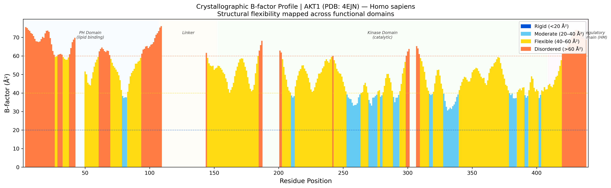

# 🧬 Structural Analysis of TNBC Hub Kinase AKT1

[](https://www.rcsb.org/structure/4EJN)
[]()
[]()
[](https://opensource.org/licenses/MIT)

## 📌 Overview

This repository extends the transcriptomic analysis of Triple-Negative Breast Cancer (TNBC) into the **structural biology domain**. The 3D crystal structure of **AKT1** — a central hub kinase identified through our TNBC co-expression network and PI3K-Akt signalling hyperactivation analysis — is characterised at the per-residue level.

> **AKT1** (*RAC-alpha serine/threonine-protein kinase*, UniProt: [P31749](https://www.uniprot.org/uniprot/P31749)) is a master regulator of cell survival and proliferation. Its hyperactivation is a hallmark of TNBC, driving chemotherapy resistance. Structural characterisation of its domain architecture informs rational therapeutic targeting.

**Structure Used:** [PDB 4EJN](https://www.rcsb.org/structure/4EJN) — Crystal structure of autoinhibited AKT1 in complex with a kinase inhibitor. Resolution: **2.20 Å**.

---

## 🔬 Methodology

| Step | Method | Tool |
|------|--------|------|
| 1. Structure retrieval | Experimental crystal structure download | RCSB PDB (4EJN) |
| 2. B-factor extraction | Per-residue Cα B-factor parsing | Biopython (`PDBParser`) |
| 3. Flexibility profiling | Crystallographic temperature factor analysis | NumPy |
| 4. Domain annotation | AKT1 PH / Kinase / HM domain boundaries mapped | Manual + UniProt |
| 5. Visualization | Publication-ready colour-coded bar chart | Matplotlib |

---

## 📊 Key Results: B-factor Structural Flexibility Profile

The **crystallographic B-factor** quantifies atomic thermal motion and structural disorder per residue — analogous to the pLDDT confidence score in AlphaFold2 predictions.

| B-factor (Ų) | Interpretation | Count | % |
|--------------|---------------|-------|---|
| < 20  | Rigid, well-ordered | 0 | 0.0% |
| 20–40 | Moderate motion | 59 | 15.7% |
| 40–60 | Flexible loop region | 248 | 65.9% |
| > 60  | Highly disordered | 69 | 18.4% |

> **Structural insight:** 84.3% of AKT1 residues in this crystal structure exhibit high flexibility (B > 40 Ų), consistent with the known conformational dynamics of AKT1's regulatory domain — a key mechanism for its allosteric activation in cancer cells.

### B-factor Profile (Domain-Annotated)



---

## 🗂️ Repository Structure

```
AlphaFold-TNBC/
├── data/
│   ├── AKT1_P31749.fasta         ← Canonical UniProt sequence (480 aa)
│   └── AKT1_ranked_0.pdb         ← Crystal structure (RCSB: 4EJN, 2.20 Å)
├── figures/
│   └── AKT1_Bfactor.png          ← Per-residue B-factor plot (auto-generated)
├── analysis.py                    ← Main structural analysis script
└── README.md
```

---

## ⚙️ Reproduce This Analysis

```bash
# 1. Install dependencies
pip install biopython matplotlib numpy

# 2. Run analysis
python analysis.py
# Output: figures/AKT1_Bfactor.png + summary statistics
```

---

## 🔗 Connection to TNBC Transcriptomics

This structural analysis directly complements the RNA-seq findings in the [Bioinformatics-analysis](https://github.com/SuleimanHajizadeh/Bioinformatics-analysis) repository:

- **Transcriptomic level:** AKT1 identified as a hub gene with significant upregulation in TNBC (PI3K-Akt network)
- **Structural level:** Crystal structure reveals a highly flexible regulatory domain — mechanistically explaining its susceptibility to allosteric activation in tumour cells

---

## 🎓 Academic Context
This project demonstrates proficiency in **structural bioinformatics** — parsing, analysing, and visualising 3D molecular data using programmatic tools. It completes the **multi-scale biological analysis pipeline**: gene expression → network topology → protein 3D structure.

---

**Author:** Suleiman Hajizadeh | Bioinformatician @ IMBB, Azerbaijan
📧 suleyman.hacizade1@gmail.com
