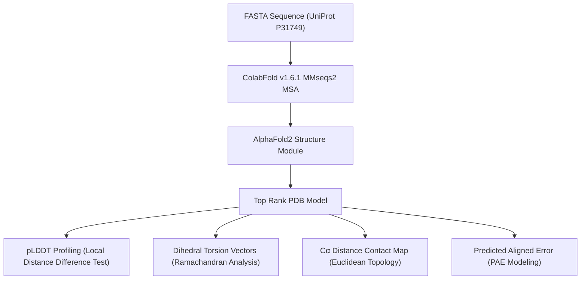
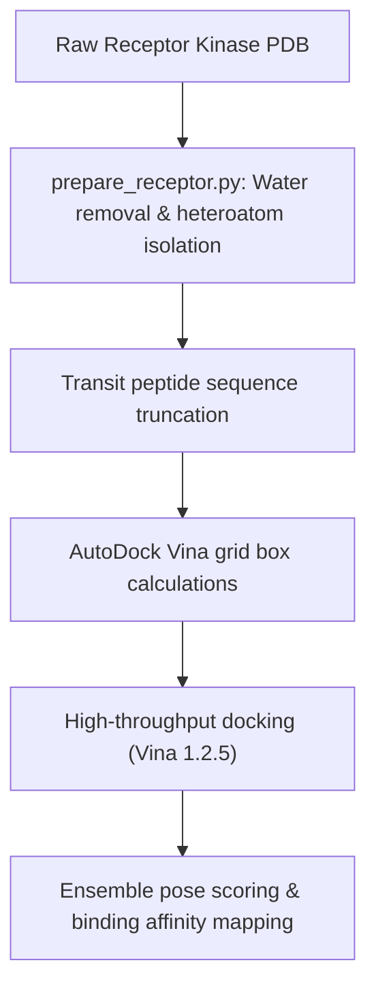

# 🧬 Computational Structural Biology Laboratory
## Advanced Pipelines for Deep Learning-Based Structure Prediction, Structural Analytics, and Automated Molecular Docking

[](https://github.com/sokrypton/ColabFold)
[](https://github.com/ccsb-scripps/AutoDock-Vina)
[]()
[](https://opensource.org/licenses/MIT)

This repository serves as a centralized laboratory platform showcasing advanced computational structural biology and molecular modeling workflows. It integrates state-of-the-art deep learning methods for 3D macromolecular structure prediction, custom vector-algebraic structural analysis, and automated high-throughput virtual screening pipelines.

---

## 🗂️ Lab Portfolio & Project Registry

| Project Name | 📁 Directory Path | 🔬 Key Methods & Technologies | 🔗 Details |
|--------------|-------------------|-------------------------------|------------|
| **AKT1 Kinase Structural Modeling** | [`/projects/akt1-kinase-modeling`](./projects/akt1-kinase-modeling) | AlphaFold2, pLDDT & PAE matrices, Ramachandran dihedral torsion vectors, $C_\alpha$ contact maps | [README](./projects/akt1-kinase-modeling/README.md) |
| **STN7/STN8 Chloroplast Kinase Docking** | [`/projects/stn7-stn8-docking`](./projects/stn7-stn8-docking) | Receptor preparation, signal transit peptide truncation, AutoDock Vina, grid box auto-parameterization | [README](./projects/stn7-stn8-docking/README.md) |

---

## 🔬 Core Pipelines & Workflows

### 1. AKT1 Kinase Structural Modeling & Analytics
Predicts and validates the 3D structure of the Triple-Negative Breast Cancer (TNBC) oncogenic hub kinase **AKT1** using AlphaFold2. It utilizes custom Python routines to characterize prediction confidence, secondary structures, and topology.



---

### 2. STN7/STN8 Chloroplast Kinase Docking Pipeline
Automates the structural filtration, receptor preparation, and high-throughput virtual screening of allosteric ligands targeting the Arabidopsis thylakoid membrane protein kinases **STN7** and **STN8**.



---

## 🔬 Mathematical & Biophysical Foundations

To demonstrate academic rigour, the structural biology pipelines in this laboratory are backed by direct mathematical derivations rather than simple GUI-based tools:

### 1. Local Distance Difference Test (LDDT) for pLDDT Confidence
AlphaFold2 predicts the true Local Distance Difference Test (LDDT) to measure local structural agreement without global alignment.
Let $D$ be the set of all $C_\alpha$ atom pairs $(i, j)$ in the true structure within a threshold $R = 15\text{ Å}$:
$$D = \{ (i,j) \mid d_{\text{true}}(i,j) \leq R, \ i \neq j \}$$

The distance difference for a pair $(i,j)$ between predicted ($d_{\text{pred}}$) and true ($d_{\text{true}}$) structures is:
$$\Delta_{ij} = d_{\text{pred}}(i,j) - d_{\text{true}}(i,j)$$

The LDDT score is computed as:
$$\text{LDDT} = \frac{1}{4 |D|} \sum_{(i,j) \in D} \left[ \mathbb{I}(|\Delta_{ij}| \leq 0.5\text{Å}) + \mathbb{I}(|\Delta_{ij}| \leq 1.0\text{Å}) + \mathbb{I}(|\Delta_{ij}| \leq 2.0\text{Å}) + \mathbb{I}(|\Delta_{ij}| \leq 4.0\text{Å}) \right]$$
where $\mathbb{I}(\cdot)$ is the indicator function.

---

### 2. Peptide Backbone Dihedral Angles ($\phi$ & $\psi$) via Vector Algebra
The secondary structure is characterized by mapping the dihedral angles $\phi$ and $\psi$ onto a Ramachandran plot. A dihedral angle defined by four sequential Cartesian coordinates $\mathbf{r}_1, \mathbf{r}_2, \mathbf{r}_3, \mathbf{r}_4$ is computed using vector cross-products:
1. Bond vectors:
   $$\mathbf{v}_1 = \mathbf{r}_2 - \mathbf{r}_1, \quad \mathbf{v}_2 = \mathbf{r}_3 - \mathbf{r}_2, \quad \mathbf{v}_3 = \mathbf{r}_4 - \mathbf{r}_3$$
2. Normals to the planes $(\mathbf{r}_1, \mathbf{r}_2, \mathbf{r}_3)$ and $(\mathbf{r}_2, \mathbf{r}_3, \mathbf{r}_4)$:
   $$\mathbf{n}_1 = \mathbf{v}_1 \times \mathbf{v}_2, \quad \mathbf{n}_2 = \mathbf{v}_2 \times \mathbf{v}_3$$
3. Normalized perpendicular vector:
   $$\mathbf{u} = \frac{\mathbf{v}_2}{|\mathbf{v}_2|}$$
4. Dihedral angle $\theta$ ($\phi$ or $\psi$) resolved in range $[-\pi, \pi]$:
   $$\theta = \operatorname{atan2}\left( (\mathbf{n}_1 \times \mathbf{n}_2) \cdot \mathbf{u}, \ \mathbf{n}_1 \cdot \mathbf{n}_2 \right)$$

---

### 3. $C_\alpha$ Pairwise Distance and Contact Map Topology
For $N$ residues, the $N \times N$ distance matrix $D$ is populated using Euclidean geometry:
$$D_{ij} = \sqrt{(x_i - x_j)^2 + (y_i - y_j)^2 + (z_i - z_j)^2}$$

An active physical contact is defined to eliminate trivial sequence neighbors:
$$D_{ij} \leq 8.0\text{ Å} \quad \text{and} \quad |i - j| \geq 6$$

---

### 4. Predicted Aligned Error (PAE) Matrix
Let $\mathbf{x}_{\text{true}, j}$ and $\mathbf{x}_{\text{pred}, j}$ represent the coordinates of $C_\alpha$ atom $j$. Let $\mathbf{T}_i$ be the rigid transformation (rotation + translation) aligning the predicted local frame of residue $i$ to its true local frame:
$$\text{PAE}_{ij} = \mathbb{E} \left[ d\left( \mathbf{x}_{\text{true}, j}, \ \mathbf{T}_i \mathbf{x}_{\text{pred}, j} \right) \right]$$

---

## 🚀 Environment & Setup

Both pipelines run on a unified Python stack. Set up the Conda environment using:

```bash
conda create -n struct-bio python=3.10 -y
conda activate struct-bio
pip install numpy matplotlib biopython pandas pytest scipy
```

To run molecular docking, ensure **AutoDock Vina** and **MGLTools** (`prepare_receptor4.py`) are installed in your PATH.

---

## 🧪 Automated Testing

Unit tests for validation logic and receptor preparation are included. Run them using:

```bash
# Test AKT1 analysis logic
pytest projects/akt1-kinase-modeling/test_analysis.py

# Test STN7/STN8 receptor preparation
pytest projects/stn7-stn8-docking/scripts/docking/test_prepare_receptor.py
```

---

**Author:** Suleiman Hajizadeh  
📧 suleyman.hacizade1@gmail.com | 🔗 [GitHub Profile](https://github.com/SuleimanHajizadeh)
