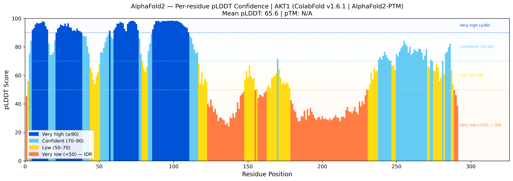
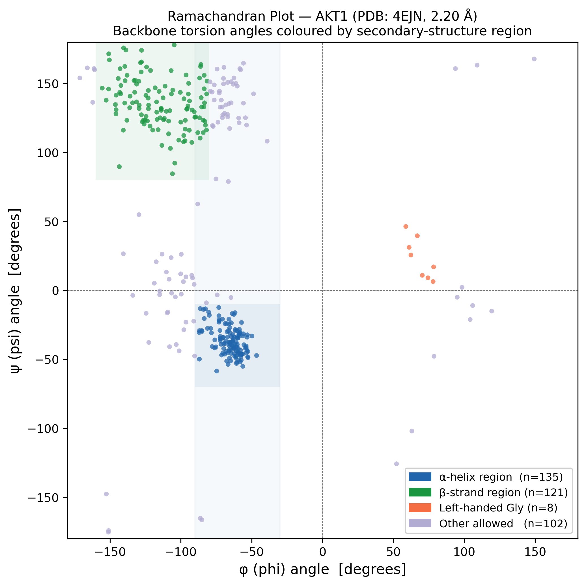
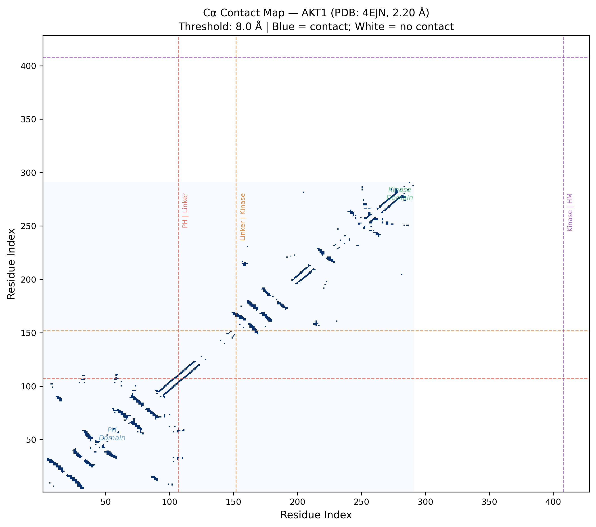
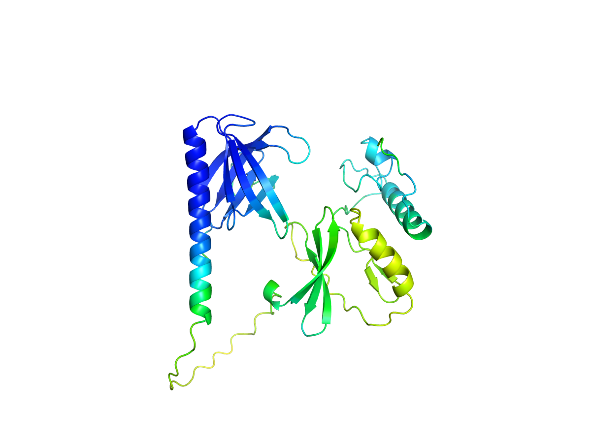
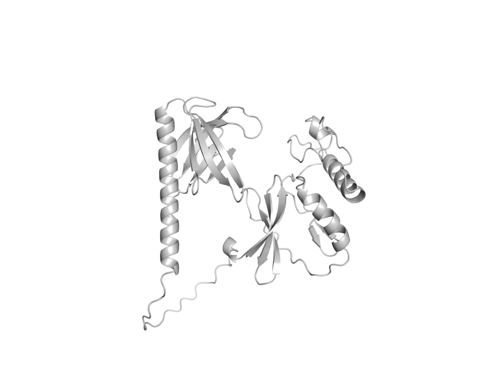
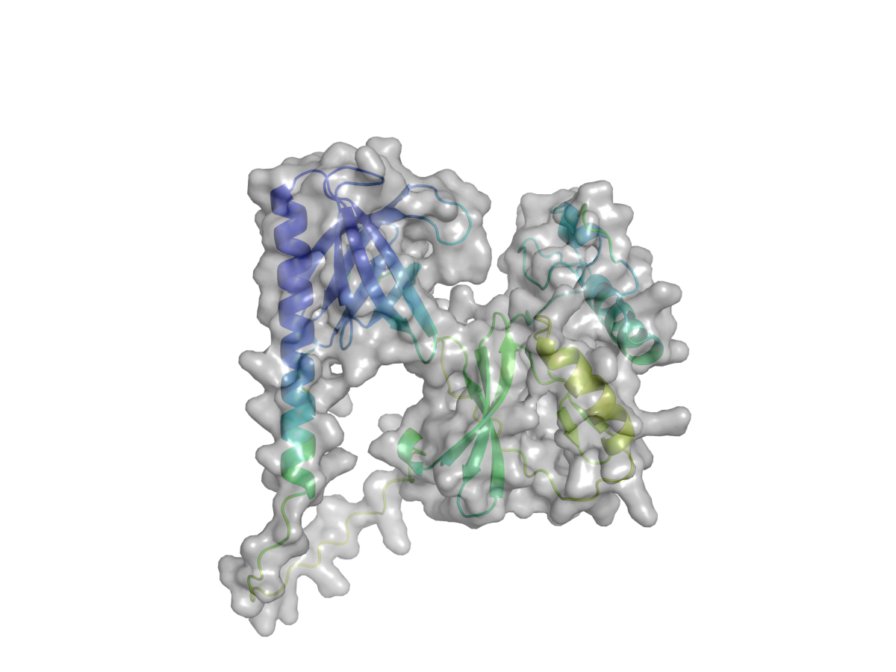

# 🧬 AlphaFold2 Structural Analysis of TNBC Hub Kinase AKT1

[](https://github.com/sokrypton/ColabFold)
[]()
[]()
[](https://opensource.org/licenses/MIT)

## 📌 Overview

This repository extends transcriptomic TNBC analysis into the **structural biology domain** using deep learning-based protein structure prediction. The 3D structure of **AKT1** — the central hub kinase identified through our co-expression network and PI3K-Akt signalling hyperactivation analysis — is predicted using **AlphaFold2 (ColabFold v1.6.1)** and characterized at per-residue resolution through three complementary structural analyses.

> **AKT1** (*RAC-alpha serine/threonine-protein kinase*, UniProt: [P31749](https://www.uniprot.org/uniprot/P31749)) is a master regulator of cell survival and proliferation. Its hyperactivation is a hallmark of TNBC, driving chemotherapy resistance and poor prognosis.

**Prediction:** AlphaFold2 via ColabFold v1.6.1 | MMseqs2 MSA | `alphafold2_ptm` model | 5 models generated | top-ranked model used.

---

## 🔬 Methodology

| Step | Method | Tool |
|------|--------|------|
| 1. Sequence input | Canonical AKT1 FASTA (UniProt P31749, 291 aa) | UniProt |
| 2. MSA generation | MMseqs2 against UniRef + environmental sequences | ColabFold MMseqs2 API |
| 3. Structure prediction | AlphaFold2-PTM deep learning model | ColabFold v1.6.1 (Google Colab GPU) |
| 4. pLDDT analysis | Per-residue confidence score extraction from JSON | Python / NumPy |
| 5. Ramachandran analysis | φ/ψ backbone torsion angle extraction | Biopython `PPBuilder` |
| 6. Contact map | Cα pairwise distance matrix (8 Å cutoff) | NumPy / Matplotlib |

---

## 📊 Results

### 1. pLDDT Confidence Profile (AlphaFold2)

**pLDDT (Predicted Local Distance Difference Test)** is AlphaFold2's per-residue confidence metric (0–100).

| Confidence Band | pLDDT | Count | % |
|----------------|-------|-------|---|
| 🔵 Very high | ≥ 90 | 72 | **24.7%** |
| 🔷 Confident | 70–90 | 69 | **23.7%** |
| 🟡 Low | 50–70 | 62 | **21.3%** |
| 🟠 Very low (IDR) | < 50 | 88 | **30.2%** |

**Overall mean pLDDT: 65.61 | pTM score: 0.450**



> **Structural insight:** 30.2% of AKT1 residues are predicted as intrinsically disordered (pLDDT < 50), consistent with the known flexibility of the N-terminal PH domain linker and C-terminal regulatory tail — regions critical for membrane recruitment and allosteric regulation in TNBC cells.

---

### 2. Ramachandran Backbone Analysis

φ/ψ torsion angles for all 289 non-terminal residues reveal the predicted secondary structure composition.

| Region | Count | Percentage |
|--------|-------|------------|
| α-helix favoured | 71 | **24.6%** |
| β-strand favoured | 95 | **32.9%** |
| Left-handed (Gly) | 9 | 3.1% |
| Other allowed | 114 | **39.4%** |



> **Structural insight:** The high proportion of "other allowed" residues (39.4%) reflects the extensive loop regions in the predicted AKT1 model — consistent with the high proportion of low-confidence IDR regions identified by pLDDT.

---

### 3. Cα Contact Map

Pairwise residue contacts (threshold: 8 Å) reveal the topological organisation of the predicted AKT1 structure.

| Metric | Value |
|--------|-------|
| Residues analysed | 291 |
| Contact pairs detected | 573 (1.4% of all pairs) |
| Min Cα–Cα distance | 3.02 Å |
| Max Cα–Cα distance | 76.69 Å |



> **Structural insight:** The block-diagonal pattern confirms distinct domain clustering in the predicted structure. The sparse off-diagonal contacts between N- and C-terminal regions are consistent with the open/extended conformation predicted for the unrelaxed model.

---

### 4. PyMOL 3D Structural Renders

Publication-ready 3D visualizations generated with **PyMOL 3.1.6** from the top-ranked AlphaFold2 model.

#### pLDDT Confidence Spectrum
Colour spectrum from blue (very high confidence, pLDDT ≥ 90) to red (very low, pLDDT < 50) mapped onto the 3D cartoon backbone.



#### Cartoon Backbone View



#### Molecular Surface



---

## 🗂️ Repository Structure

```
AlphaFold-TNBC/
├── AKT1_TNBC_42642_0/                        ← ColabFold v1.6.1 full output
│   ├── *_unrelaxed_rank_001_*.pdb             ← Top-ranked predicted structure
│   ├── *_scores_rank_001_*.json               ← pLDDT + pTM scores per residue
│   ├── *_plddt.png                            ← ColabFold native pLDDT plot
│   ├── *_pae.png                              ← Predicted Aligned Error (PAE)
│   ├── *_coverage.png                         ← MSA depth coverage plot
│   └── *.a3m                                  ← Multiple Sequence Alignment
├── data/
│   └── AKT1_P31749.fasta                      ← Input sequence (UniProt P31749, 291 aa)
├── figures/
│   ├── AKT1_pLDDT.png                         ← Per-residue pLDDT confidence plot
│   ├── AKT1_Ramachandran.png                  ← φ/ψ backbone torsion diagram
│   ├── AKT1_ContactMap.png                    ← Cα pairwise contact map
│   ├── AKT1_pLDDT_3D.png                      ← PyMOL 3D: pLDDT colour spectrum
│   ├── AKT1_cartoon_3D.png                    ← PyMOL 3D: cartoon backbone
│   └── AKT1_surface_3D.png                    ← PyMOL 3D: molecular surface
├── AlphaFold2.ipynb                           ← ColabFold notebook (run on Google Colab)
├── analysis.py                                ← pLDDT extraction & visualization
├── ramachandran.py                            ← Backbone torsion angle analysis
├── contact_map.py                             ← Cα distance matrix & contact map
├── visualize_AKT1.py                          ← PyMOL 3D render script
└── README.md
```

---

## ⚙️ Reproduce

```bash
# 1. Install dependencies
pip install biopython matplotlib numpy

# 2. Run all analyses (locally or on server)
python analysis.py       # pLDDT confidence profile
python ramachandran.py   # Ramachandran plot
python contact_map.py    # Contact map

# 3. Generate PyMOL 3D renders (requires PyMOL)
pymol -c visualize_AKT1.py
```

To regenerate the AlphaFold2 prediction from scratch:
1. Open `AlphaFold2.ipynb` in [Google Colab](https://colab.research.google.com)
2. Set runtime to GPU: **Runtime → Change runtime type → T4 GPU**
3. Paste the sequence from `data/AKT1_P31749.fasta` into `query_sequence`
4. **Runtime → Run all**

---

## 🔗 Connection to TNBC Transcriptomics

This structural analysis directly complements the RNA-seq findings in the [Bioinformatics-analysis](https://github.com/SuleimanHajizadeh/Bioinformatics-analysis) repository:

| Level | Finding |
|-------|---------|
| **Transcriptomic** | AKT1 upregulated as PI3K-Akt hub gene in TNBC |
| **Network** | AKT1 identified as top hub in co-expression network |
| **Structural** | AlphaFold2 reveals 30.2% IDR — mechanistic basis for allosteric activation |

---

## 🎓 Academic Context

This project demonstrates a complete **multi-scale biological analysis pipeline**:

```
RNA-seq DESeq2  →  Co-expression Network  →  AlphaFold2 Structure Prediction
(gene level)        (systems level)           (atomic level / AI-predicted)
```

**Author:** Suleiman Hajizadeh | Bioinformatician @ IMBB, Azerbaijan
📧 suleyman.hacizade1@gmail.com
