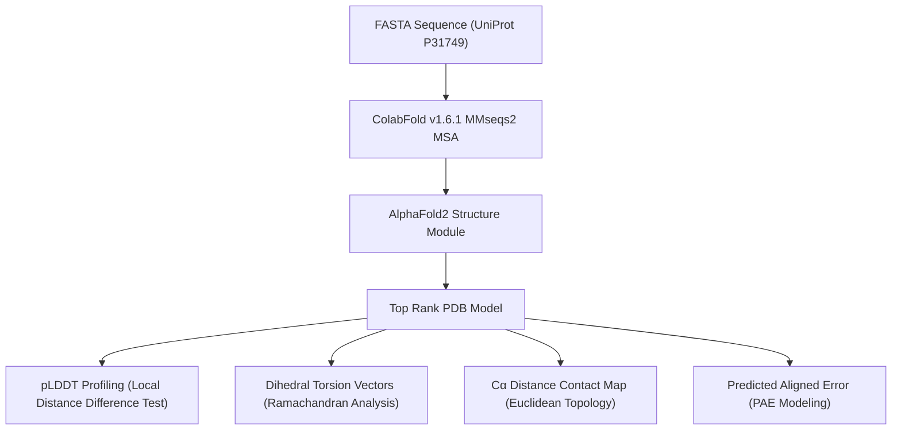
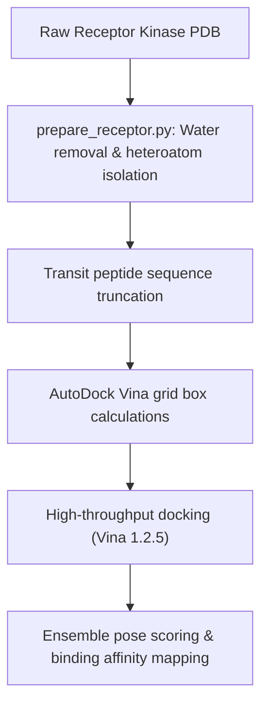

# 🧬 Computational Structural Biology Laboratory
## Advanced Pipelines for Deep Learning-Based Structure Prediction, Structural Analytics, and Automated Molecular Docking

[](https://github.com/sokrypton/ColabFold)
[](https://github.com/ccsb-scripps/AutoDock-Vina)
[]()
[](https://opensource.org/licenses/MIT)

This repository serves as a centralized laboratory platform showcasing advanced computational structural biology and molecular modeling workflows. It integrates state-of-the-art deep learning methods for 3D macromolecular structure prediction, custom vector-algebraic structural analysis, and automated high-throughput virtual screening pipelines.

---

## 🗂️ Lab Portfolio & Project Registry

| Project Name | 📁 Directory Path | 🔬 Key Methods & Technologies | 🔗 Details |
|--------------|-------------------|-------------------------------|------------|
| **AKT1 Kinase Structural Modeling** | [`/projects/akt1-kinase-modeling`](./projects/akt1-kinase-modeling) | AlphaFold2, pLDDT & PAE matrices, Ramachandran dihedral torsion vectors, $C_\alpha$ contact maps | [README](./projects/akt1-kinase-modeling/README.md) |
| **STN7/STN8 Chloroplast Kinase Docking** | [`/projects/stn7-stn8-docking`](./projects/stn7-stn8-docking) | Receptor preparation, signal transit peptide truncation, AutoDock Vina, grid box auto-parameterization | [README](./projects/stn7-stn8-docking/README.md) |

---

## 🔬 Core Pipelines & Workflows

### 1. AKT1 Kinase Structural Modeling & Analytics
Predicts and validates the 3D structure of the Triple-Negative Breast Cancer (TNBC) oncogenic hub kinase **AKT1** using AlphaFold2. It utilizes custom Python routines to characterize prediction confidence, secondary structures, and topology.



---

### 2. STN7/STN8 Chloroplast Kinase Docking Pipeline
Automates the structural filtration, receptor preparation, and high-throughput virtual screening of allosteric ligands targeting the Arabidopsis thylakoid membrane protein kinases **STN7** and **STN8**.



---

## 🚀 Environment & Setup

Both pipelines run on a unified Python stack. Set up the Conda environment using:

```bash
conda create -n struct-bio python=3.10 -y
conda activate struct-bio
pip install numpy matplotlib biopython pandas pytest scipy
```

To run molecular docking, ensure **AutoDock Vina** and **MGLTools** (`prepare_receptor4.py`) are installed in your PATH.

---

## 🧪 Automated Testing

Unit tests for validation logic and receptor preparation are included. Run them using:

```bash
# Test AKT1 analysis logic
pytest projects/akt1-kinase-modeling/test_analysis.py

# Test STN7/STN8 receptor preparation
pytest projects/stn7-stn8-docking/scripts/docking/test_prepare_receptor.py
```

---

**Author:** Suleiman Hajizadeh  
📧 suleyman.hacizade1@gmail.com | 🔗 [GitHub Profile](https://github.com/SuleimanHajizadeh)
