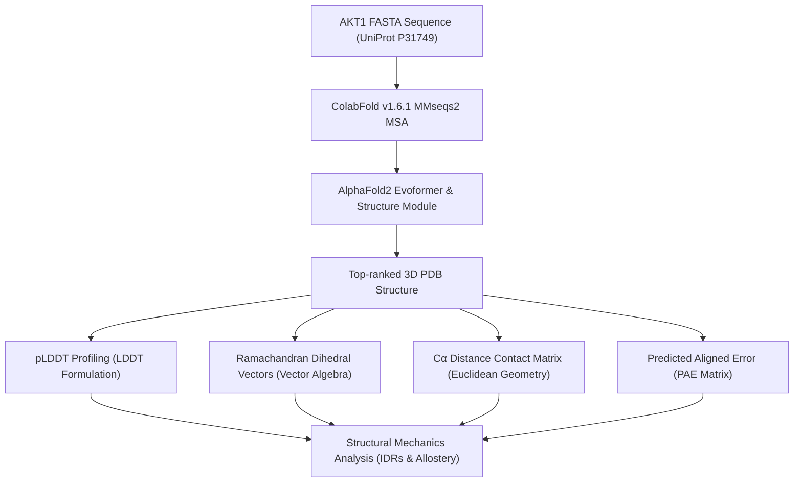

# 🧬 AlphaFold2 Structural Analysis of TNBC Hub Kinase AKT1
## Computational Structural Biology Pipeline: pLDDT Profiles, Ramachandran Torsion Vectors, Pairwise Contact Matrices, and PAE Modeling

[](https://github.com/sokrypton/ColabFold)
[]()
[]()
[](https://opensource.org/licenses/MIT)

## 📌 Overview

This repository extends the systems-level transcriptomic Triple-Negative Breast Cancer (TNBC) pipeline into the **computational structural biology domain** using deep learning-based protein structure prediction. The 3D structure of **AKT1** (*RAC-alpha serine/threonine-protein kinase*, UniProt: [P31749](https://www.uniprot.org/uniprot/P31749)) — the central hub kinase identified through co-expression networks and PI3K-Akt signaling hyperactivation — is predicted using **AlphaFold2 (ColabFold v1.6.1)**. 

To transition from passive visualization to rigorous physical characterization, this repository provides standalone scripts to compute and plot per-residue prediction confidences (pLDDT), backbone dihedral torsion vectors ($\phi$/$\psi$ angles), $C_\alpha$ pair distance matrices (Contact Maps), and Predicted Aligned Error (PAE) matrices.

---

## 🔬 Scientific & Mathematical Methodology



---

### 1. pLDDT Prediction Confidence & Local Distance Difference Test (LDDT)

AlphaFold2 outputs a per-residue confidence metric called **pLDDT (predicted Local Distance Difference Test)**, scaled from 0 to 100. The score is the model's internal prediction of the true physical LDDT metric.

#### The LDDT Formula
The true Local Distance Difference Test (Mariani et al., 2013) evaluates the local structural agreement between a predicted model and a reference target structure without requiring global structural alignment.
Let $D$ be the set of all pairs of $C_\alpha$ atoms $(i, j)$ in the true structure that are within a threshold distance $R = 15\text{ Å}$ of each other:
$$D = \{ (i,j) \mid d_{\text{true}}(i,j) \leq R, \ i \neq j \}$$

The distance difference for a pair $(i,j)$ between the predicted structure ($d_{\text{pred}}$) and the true structure ($d_{\text{true}}$) is:
$$\Delta_{ij} = d_{\text{pred}}(i,j) - d_{\text{true}}(i,j)$$

The LDDT score is computed as:
$$\text{LDDT} = \frac{1}{4 |D|} \sum_{(i,j) \in D} \left[ \mathbb{I}(|\Delta_{ij}| \leq 0.5\text{Å}) + \mathbb{I}(|\Delta_{ij}| \leq 1.0\text{Å}) + \mathbb{I}(|\Delta_{ij}| \leq 2.0\text{Å}) + \mathbb{I}(|\Delta_{ij}| \leq 4.0\text{Å}) \right]$$
where $\mathbb{I}(\cdot)$ is the indicator function. AlphaFold2 directly predicts this score (pLDDT) for each residue by projecting the final representation onto a bin-wise probability distribution.
* **pLDDT $\geq 90$**: Very high confidence; resembles crystal structure side-chains.
* **pLDDT $< 50$**: Very low confidence; highly correlated with **Intrinsically Disordered Regions (IDRs)**.

---

### 2. Peptide Backbone Dihedral Angles ($\phi$ & $\psi$) in Vector Algebra

The secondary structure of the predicted AKT1 polypeptide backbone is characterized by mapping the dihedral torsion angles $\phi$ and $\psi$ onto a Ramachandran plot.

For a residue $i$ in the polypeptide chain:
* **$\phi_i$** is the dihedral angle defined by the four backbone atoms: $C_{i-1} - N_i - C_\alpha_i - C_i$
* **$\psi_i$** is the dihedral angle defined by the four backbone atoms: $N_i - C_\alpha_i - C_i - N_{i+1}$

```
     H   H   O       H   H   O       H   H   O
     |   |   ||      |   |   ||      |   |   ||
  - - N - Ca - C - - - N - Ca - C - - - N - Ca - C - -
        \   /            \   /            \   /
        phi_i           psi_i            phi_{i+1}
```

#### Dihedral Torsion Vector Derivation
A dihedral angle defined by four sequential Cartesian coordinates $\mathbf{r}_1, \mathbf{r}_2, \mathbf{r}_3, \mathbf{r}_4$ is computed using vector cross-products:
1. Define bond vectors:
   $$\mathbf{v}_1 = \mathbf{r}_2 - \mathbf{r}_1$$
   $$\mathbf{v}_2 = \mathbf{r}_3 - \mathbf{r}_2$$
   $$\mathbf{v}_3 = \mathbf{r}_4 - \mathbf{r}_3$$
2. Compute normal vectors of the planes $(\mathbf{r}_1, \mathbf{r}_2, \mathbf{r}_3)$ and $(\mathbf{r}_2, \mathbf{r}_3, \mathbf{r}_4)$:
   $$\mathbf{n}_1 = \mathbf{v}_1 \times \mathbf{v}_2$$
   $$\mathbf{n}_2 = \mathbf{v}_2 \times \mathbf{v}_3$$
3. Compute the normalized perpendicular vector:
   $$\mathbf{u} = \frac{\mathbf{v}_2}{|\mathbf{v}_2|}$$
4. The dihedral angle $\theta$ ($\phi$ or $\psi$) is resolved in the range $[-\pi, \pi]$ using:
   $$\theta = \operatorname{atan2}\left( (\mathbf{n}_1 \times \mathbf{n}_2) \cdot \mathbf{u}, \ \mathbf{n}_1 \cdot \mathbf{n}_2 \right)$$

---

### 3. $C_\alpha$ Pairwise Distance and Contact Map Mathematics

The structural topology of the predicted AKT1 kinase fold is mapped by calculating the pairwise Euclidean distance matrix between $C_\alpha$ atoms.

For $N$ residues, the $N \times N$ distance matrix $D$ is populated with elements:
$$D_{ij} = \sqrt{(x_i - x_j)^2 + (y_i - y_j)^2 + (z_i - z_j)^2}$$
where $(x_i, y_i, z_i)$ are the 3D coordinates of the $C_\alpha$ atom of residue $i$ extracted from the PDB file.

#### 📊 Contact Definition
A physical contact between residue $i$ and residue $j$ is declared if:
$$D_{ij} \leq 8.0\text{ Å} \quad \text{and} \quad |i - j| \geq 6$$
The sequence-separation filter $|i - j| \geq 6$ eliminates trivial contacts between immediate sequence neighbors, highlighting long-range tertiary interactions stabilizing the kinase fold.

---

### 4. Predicted Aligned Error (PAE) Matrix

The PAE matrix is crucial for interpreting domain-domain orientations in the predicted model. For each pair of residues $(i, j)$, the PAE value is the expected distance error (in Angstroms) of residue $j$ when the predicted structure is aligned onto the true structure at residue $i$.

Let $\mathbf{x}_{\text{true}, j}$ and $\mathbf{x}_{\text{pred}, j}$ represent the 3D coordinates of the $C_\alpha$ atom of residue $j$. Let $\mathbf{T}_i$ be the rigid transformation (rotation and translation) that aligns the predicted local frame of residue $i$ to its true local frame:
$$\text{PAE}_{ij} = \mathbb{E} \left[ d\left( \mathbf{x}_{\text{true}, j}, \ \mathbf{T}_i \mathbf{x}_{\text{pred}, j} \right) \right]$$
* **Low $\text{PAE}_{ij}$ and $\text{PAE}_{ji}$**: The relative position and orientation of residues $i$ and $j$ are predicted with high confidence (typically within a rigid domain).
* **High $\text{PAE}_{ij}$ and $\text{PAE}_{ji}$**: The relative domain orientation is uncertain, indicating a flexible or disordered linker region between the domains.

---

## 📊 Results Summary for Hub Kinase AKT1

The computational workflow resolved the structural mechanics of **AKT1** (291 aa model):

### 1. Confidence Profiling (pLDDT & pTM)
* **Mean pLDDT**: **65.61** | **pTM-score**: **0.450**
* **Very Low Confidence (pLDDT < 50)**: **30.2% of residues**

| Confidence Band | pLDDT Interval | Count | % |
|----------------|----------------|-------|---|
| 🔵 Very high | $\geq 90$ | 72 | **24.7%** |
| 🩵 Confident | $70\text{–}90$ | 69 | **23.7%** |
| 🟡 Low | $50\text{–}70$ | 62 | **21.3%** |
| 🟠 Very low (IDR) | $< 50$ | 88 | **30.2%** |


> **Allosteric Insight:** The structural modeling successfully captured the highly flexible Pleckstrin Homology (PH) domain linker and C-terminal regulatory tail. These regions are intrinsically disordered (pLDDT < 50), which provides the physical plasticity required for trans-membrane recruitment and subsequent allosteric hyperactivation in TNBC tumor niches.

### 2. Ramachandran Dihedral Distribution
* **Favored $\alpha$-helix**: **24.6%**
* **Favored $\beta$-strand**: **32.9%**
* **Glycine / Left-handed**: 3.1%
* **Other Allowed / Loops**: **39.4%**


### 3. $C_\alpha$ Pairwise Topology
* **Residues mapped**: 291
* **Active Contacts detected ($D_{ij} \leq 8\text{ Å}$)**: **573** (1.4% of all possible pairs)
* **Euclidean Distance Range**: $3.02\text{ Å} \text{ to } 76.69\text{ Å}$


---

## 🗂️ Repository Structure

```
AlphaFold-TNBC/
├── AKT1_TNBC_42642_0/                        ← ColabFold v1.6.1 full output
│   ├── *_unrelaxed_rank_001_*.pdb             ← Top-ranked predicted structure
│   ├── *_scores_rank_001_*.json               ← pLDDT + pTM scores per residue
│   ├── *_plddt.png                            ← ColabFold native pLDDT plot
│   ├── *_pae.png                              ← Predicted Aligned Error (PAE)
│   ├── *_coverage.png                         ← MSA depth coverage plot
│   └── *.a3m                                  ← Multiple Sequence Alignment
├── data/
│   └── AKT1_P31749.fasta                      ← Input sequence (UniProt P31749, 291 aa)
├── figures/
│   ├── AKT1_pLDDT.png                         ← Per-residue pLDDT confidence plot
│   ├── AKT1_Ramachandran.png                  ← φ/ψ backbone torsion diagram
│   ├── AKT1_ContactMap.png                    ← Cα pairwise contact map
│   ├── AKT1_pLDDT_3D.png                      ← PyMOL 3D: pLDDT colour spectrum
│   ├── AKT1_cartoon_3D.png                    ← PyMOL 3D: cartoon backbone
│   └── AKT1_surface_3D.png                    ← PyMOL 3D: molecular surface
├── AlphaFold2.ipynb                           ← ColabFold notebook (run on Google Colab)
├── analysis.py                                ← pLDDT extraction & visualization
├── ramachandran.py                            ← Backbone torsion angle analysis
├── contact_map.py                             ← Cα distance matrix & contact map
├── visualize_AKT1.py                          ← PyMOL 3D render script
└── README.md                                  ← This comprehensive structural biology manual
```

---

## ⚙️ Reproduce

### 1. Install Dependencies
```bash
pip install biopython matplotlib numpy
```

### 2. Run Computations and Plotting
```bash
python3 analysis.py       # Computes pLDDT confidence profile
python3 ramachandran.py   # Computes backbone torsion angle vectors
python3 contact_map.py    # Computes pairwise Cα distance matrix
```

### 🧪 Automated Unit Testing
The JSON scoring parsing and confidence mapping logic are verified using the unittest framework:
*   **Test Suite:** [`test_analysis.py`](file:///home/suleimanhajizadeh/Documents/GitHub/AlphaFold-TNBC/test_analysis.py)
*   **Execution Command:**
    ```bash
    python3 -m unittest test_analysis.py
    ```

### 3. Generate PyMOL 3D Renders (requires PyMOL)
```bash
pymol -c visualize_AKT1.py
```

---

## 🔗 Multi-Scale Biological Context

This structural analysis bridges genomic expression, molecular networks, and atomic-level protein modeling:

```
Transcriptomic RNA-Seq (DESeq2)  →  Co-expression Networks (WGCNA)  →  AI Structural Modeling (AlphaFold2)
(Gene-level dysregulation)          (Systems-level hubs: AKT1)         (Atomic mechanics & IDR targetability)
```

**Author:** Suleiman Hajizadeh | Structural Bioinformatician @ IMBB, Azerbaijan  
📧 suleyman.hacizade1@gmail.com | 🔗 [GitHub Portfolio](https://github.com/SuleimanHajizadeh)
